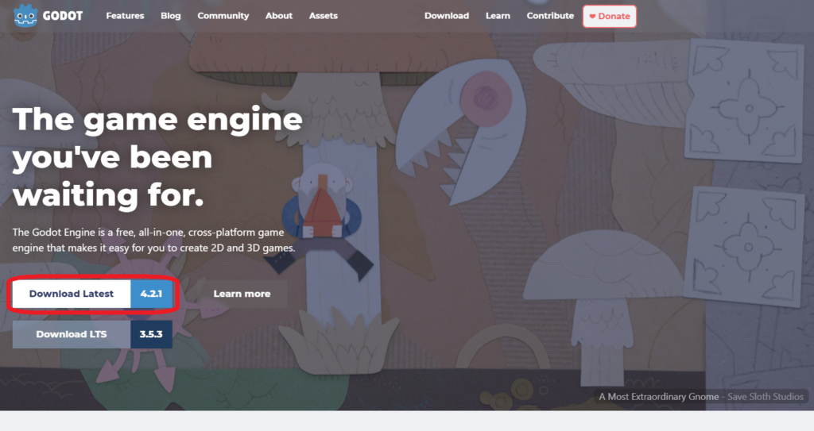
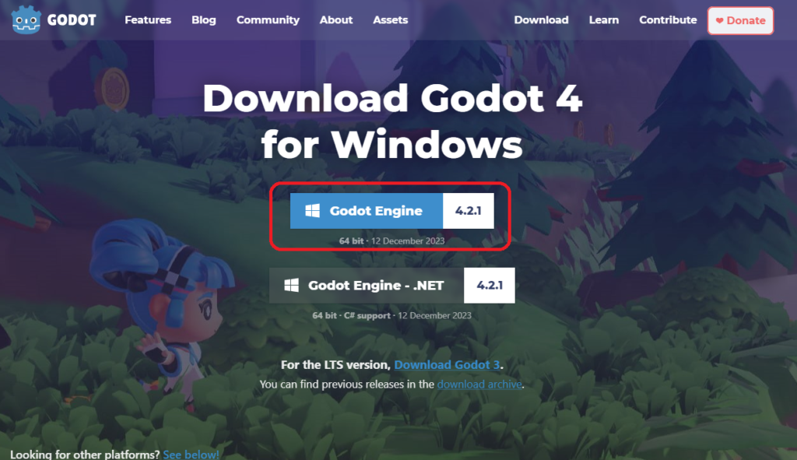
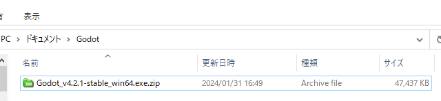
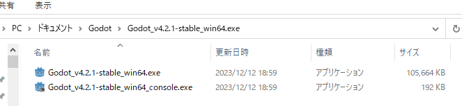
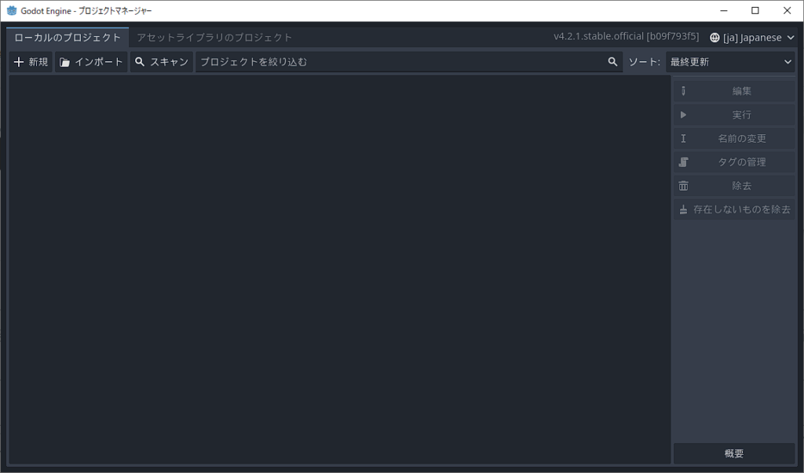

# Godot Engine とは？

まずは、ゲームを作成するのに便利なソフト、「ゲームエンジン」をインストールします。このサイトではゲームエンジンとしてGodot Engineを利用します。Godotはゴトーと読みます。また、今後は言いやすいようにGodot Engineではなく、Godotとよびます。

Godotではゲームを作成するのに一般的なPCを利用可能です(Windows, MacOS, Linux…)
また、作成したゲームを出力するのにWindows, MacOS, Linuxに加えてAndroidやiOSなどへの出力も可能です。
詳細を知りたいかたは[GodotのFAQ](https://docs.godotengine.org/ja/4.x/about/faq.html)をご覧ください。

## Godotのインストール
本サイトでは、PCでゲームを作成して、PCでプレイする流れを紹介していきます。
本ページの「Godot Engineをインストールしよう」では、利用者が多いと思われるWindowsにて操作方法を説明していますが、インストール後のGodotの操作の説明はUbuntu Linuxで行います。しかし、見た目はほとんど変わらないと思いますので安心してください。

まずは、[Godotの公式サイト](https://godotengine.org/)にアクセスしてみてください。以下のようなページが(この記事の執筆時点では)表示されます。

上記のようなサイトが表示されたら、赤枠で囲った4.2.1と書いてあるリンクを押してください。
この数字は今後、4.2.2や4.3.0などになる可能性がありますが問題ありません。
逆に、赤枠の3.5.3のリンクは押さないようにしてください。
理由としては3.5.3などの先頭が3から始まる3系と4から始まる4系の間では大きく変更となっている部分が多いため今後の説明が当てはまらない部分が出てくるためです。

4系のリンクを押すと、以下のようなサイトが表示されたら、赤枠で囲ったリンクを押してください。

すると、ブラウザ上でダウンロードが始まると思います。
ダウンロードが完了したら、該当ファイル(今回はGodot_v4.2.1-stable_win64.exe.zipというファイル名でした)を今後作業を行いたいフォルダに移動します。

今回はドキュメント配下にGodotフォルダを作成したところに移動しました。

このファイルはzipファイルなので解凍する必要があります。Windowsであればzipファイルを右クリックしてから「すべて展開」で解凍できると思います。できない場合は任意の解凍ソフトを利用してください。

すると以下のようなフォルダ構成になります。

この2つのファイルのうち、Godot_v4.2.1-stable_win64.exeをダブルクリックしてください。

すると、上記のようにGodotが起動します。

ここからは好みの問題ですが、ゲームプログラムは日本語の資料よりも英語の資料が多いので英語に慣れておくと良いことが多いです。画面右上の[ja]Japaneseを[en]EnglishにしてGodotを再起動すると英語でGodotを利用できます。googleなどで分からないことを検索するときは画面の表示名などを日本語で調べてもヒットしない場合でも英語で調べたりするとヒットすることがあります。

本サイトでも基本的には英語モードのスクリーンショットで説明していく予定です。