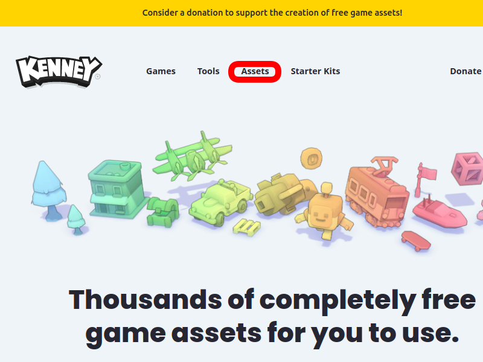
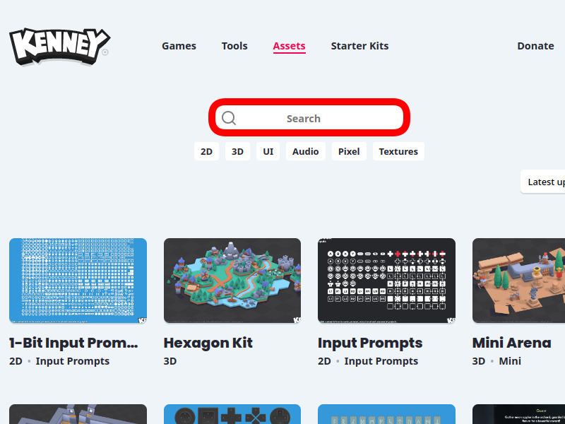
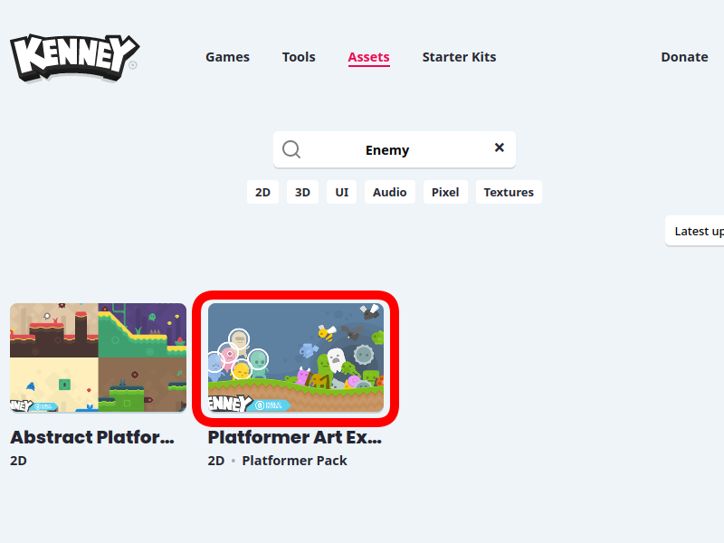
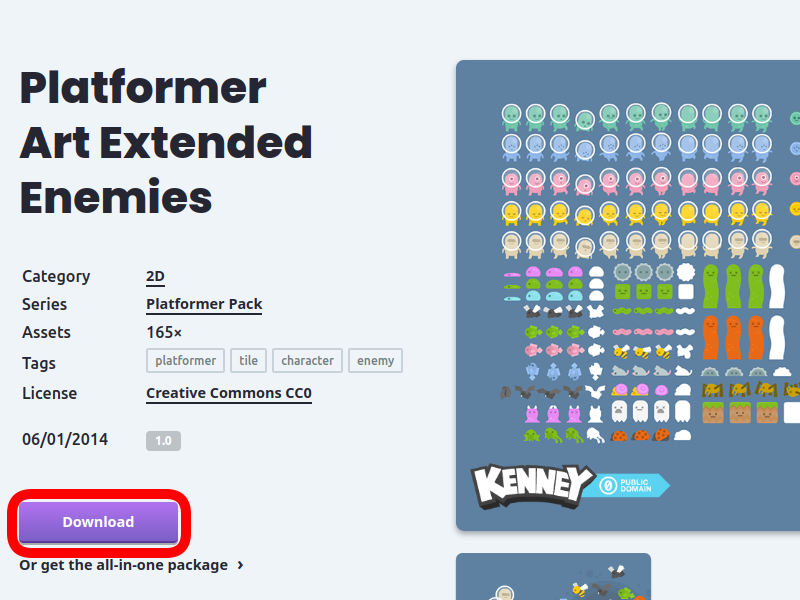
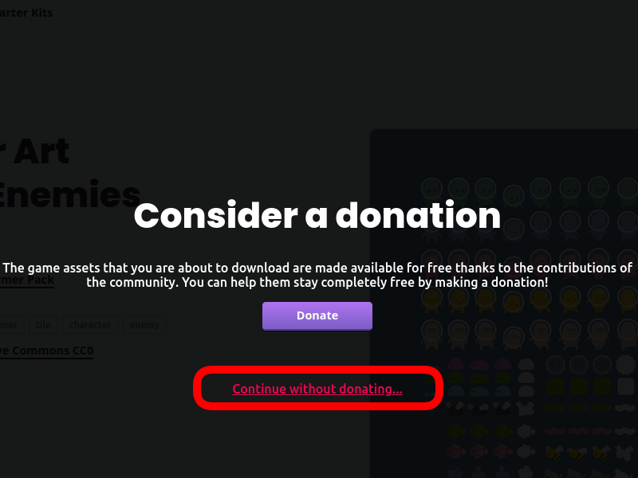
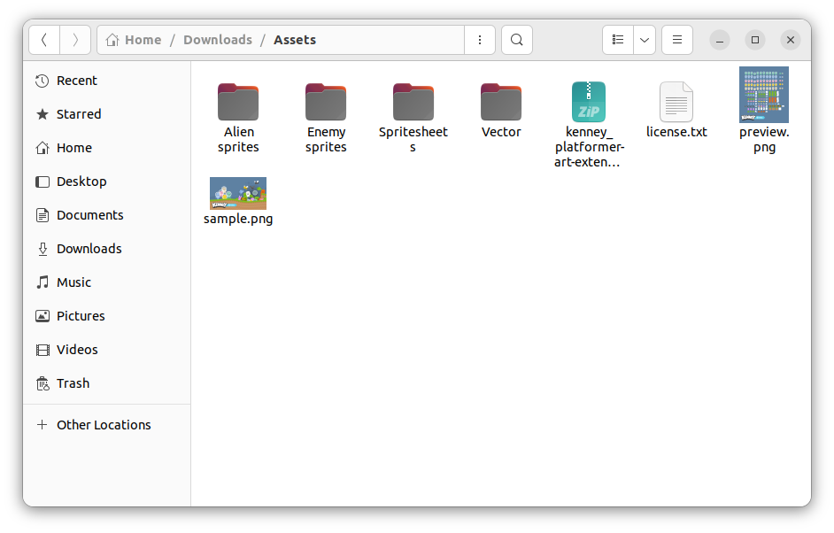

:::important
この記事はGodot Engine v4.2.1を使って解説しています。
:::

:::tip
敵をクリックしてダメージを与えて倒すというゲームを作ります。
まずは適当な大きさの敵の絵(100px x 100px 以内くらい)を準備します。
絵をかける人は自分でかいても良いですし、かけない人は以下の手順で素材を入手しましょう。
:::

# クリックゲームの作り方

まずは、以下のリンクから素材サイトに行きましょう。
[https://www.kenney.nl/](https://www.kenney.nl/)

上記のようなサイトが表示されたら、赤枠で示したAssetsをクリックします。

上記のような画面が表示されるので赤枠で囲ったSeach画面に”Enemy”と検索します。

検索結果として出てきた”Platformer Art Ex…”をクリックします。

Downloadボタンを押します。

“Continue without donating…”をクリックするとブラウザでファイルのダウンロードが始まります。
また、上記紫色のボタンの”Donate”ボタンからは寄付をすることができます。基本的に無料で使える素材ですが気にいった場合はこちらから寄付することができます。

**kenney_platformer-art-extended-enemies.zip** というファイルがダウンロードできているはずです。
このファイルを解凍してみてください。

上記のようなファイルが取得できるはずです。
これ以降の投稿では主にAlien spritesフォルダの中のデータを利用していきます。