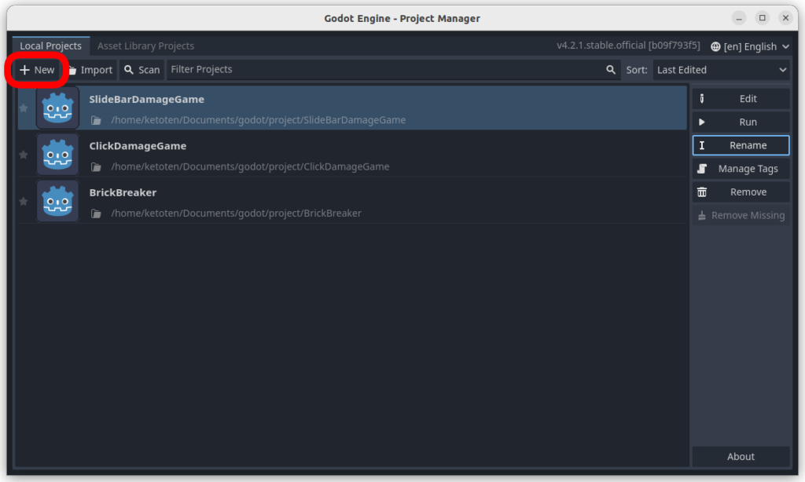
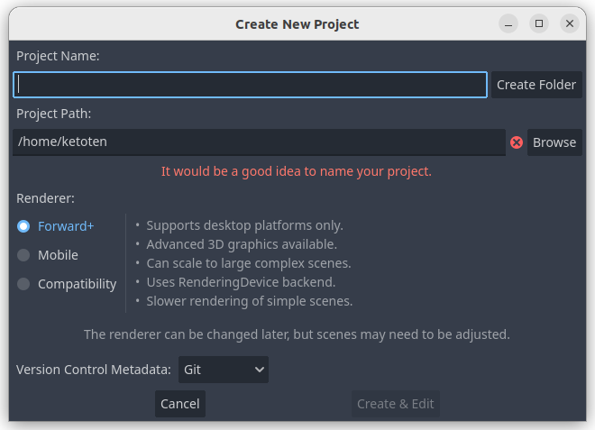
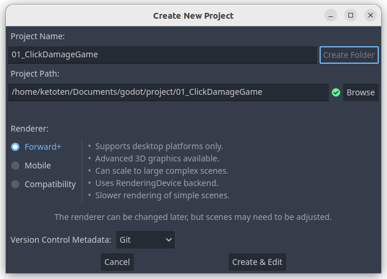
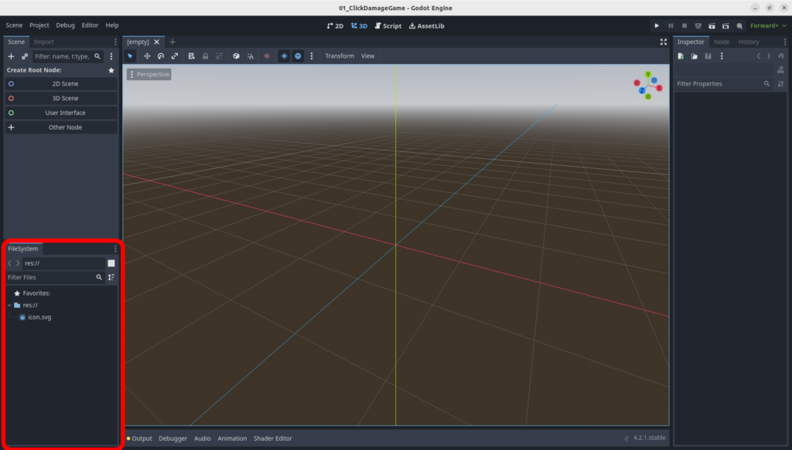
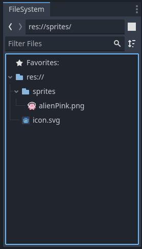
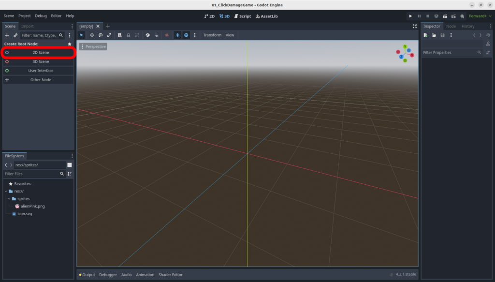
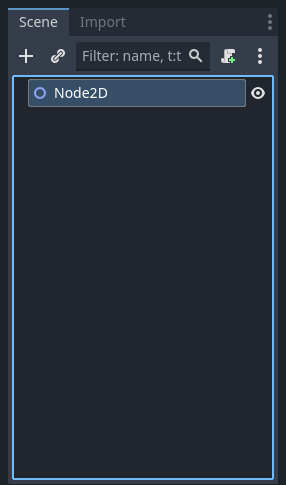
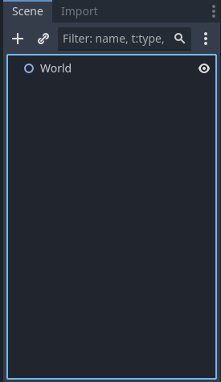
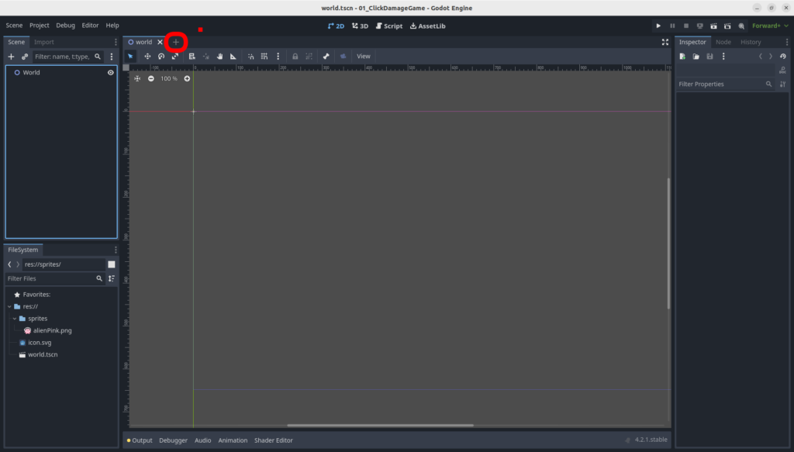
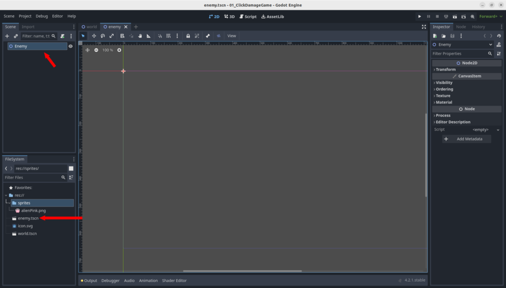

:::important
この記事はGodot Engine v4.2.1を使って解説しています。
:::

# クリックゲームの作り方

いよいよ、ゲームを作っていきます。ちなみに、Godotのバージョンはv4.2.1で説明していきます。
今回作るゲームは、敵が表示されていてマウスでクリックするとダメージを与えて倒すことができるという単純なゲームです。単純ですが基礎的な内容が多く含まれているので勉強になると思います。

Godotを起動したら、以下の画面のNewボタンを押します。

すると以下のような画面になります。

まずは、”Project Path:”に注目してください。
このフォルダの配下にプロジェクトフォルダが作成されます。
右のBrowseボタンを選択して自分のゲームを作るフォルダを選択してください。
参考までに自分は”/home/ketoten/Documents/godot/project”という場所を選択しました。
Windowsの方はマイドキュメントのどこかに作るのが良いのではないでしょうか。
次に”Project Name:”に注目してください。
ここがゲームのプロジェクトの名前になります。
今回は1番目のゲームとしてクリックゲームを作成するので”01_ClickDamageGame”という名前にしましょう。記入したら右側の”Create Folder”ボタンを押してください。
すると、”Project Path:”のテキストエリアにプロジェクト名のパスが追加されるはずです。
この状態のスクリーンショットが以下のようになります。

ここまできたら、一番下にある”Create & Edit”ボタンを押しましょう。

まずはゲーム制作に利用する素材をGodotに読み込ませます。
上記の画面の左下にある赤枠で囲ったFileSystemウィンドウの中のres://部分の上で右クリックをします。
すると、”Create New”→”Folder…”と選択するとCreate Folderダイアログが表示されますのでspritesと名前を入力してOKボタンを押します。res://の下にspritesフォルダができていれば成功です。

**(TODO:リンク方法確認)**

次に、[基本的なクリックゲームを作ろう(1)](./2024-02-05_create_basic_click_game_01)で準備したAlian Spritesフォルダの中からalienPink.pngファイルを今作成したFileSystemウィンドウのspritesフォルダにドラッグアンドドロップします。
今回はコイツを敵役として利用します。

FileSystemウィンドウのspritesフォルダを展開すると上図のようになっているはずです。

次に上記画面の赤枠で囲ったSceneウィンドウの”2D Scene”をクリックします。

上図のような画面に変化するのでNode2Dを選択した状態でF2キーを押してWorldという名前に変更してください。

上図のようになります。この状態でCtrl+Sキーを同時押しするとSave Scene As…ダイアログが表示されますのでFile:欄に記入されているままworld.tscnという名前でSaveボタンを押してres://配下に保存しましょう。

次に、上図の＋ボタンを押します。
すると左上のSceneウィンドウが初期状態と同様になりますのでここまでの手順を参考にNode2DをEnemyという名前に変更してenemy.tscnという名前でres://配下に保存してみてください。

上記のようになっていれば成功です。
Sceneウィンドウ内にEnemyノードができていること、FileSystem内にenemy.tscnができていることを確認してください。

これで下準備は終わりです。次回から本格的な作業に入っていきましょう。