:::important
この記事はGodot Engine v4.2.1を使って解説しています。
:::

# クリックゲームの作り方

前回までで、WorldシーンとEnemyシーンを作ることができました。
今回はこれらにコーディングなどをして動作を与えていきます。

画面左上のSceneウィンドウのEnemyを右クリックして”Add Child Node”を選択します。
すると、”Create New Node”ダイアログが開くので検索窓にSprite2Dと入力するとダイアログの下画面でSprite2Dノードが選択された状態なっていると思います。その状態が以下の図です。

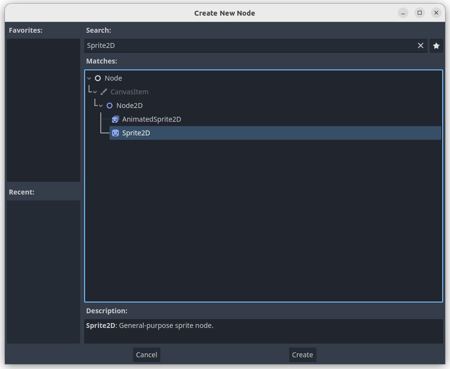

この状態でCreateを押すとSceneウィンドウが以下のようになります。

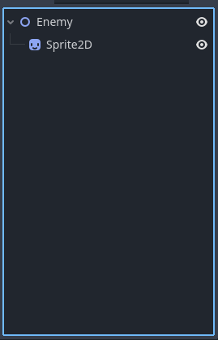

見事、Enemyノードの下にSprite2Dノードを配置することができました。
しかし、Spriteノードとは何者なのでしょう？
簡単にいうと画面に画像を表示させることのできるノードです。
では、これから画像を表示させてみましょう。
まずはSceneウィンドウのSprite2Dノードを選択します。

すると以下のような画面になるはずですので以下の赤矢印のようにalienPink.pngを右上のInspectorウィンドウの中のSprite2DにあるTextureまでドラッグアンドドロップしてみましょう。

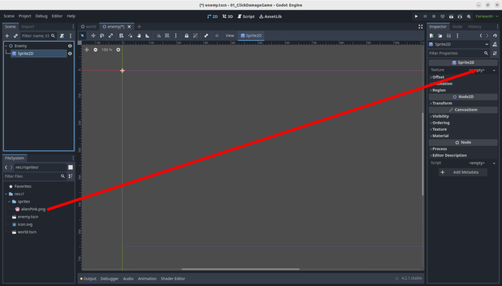

すると、真ん中のウィンドウ(enemyシーンの2Dウィンドウ)にピンクのエイリアンの画像が表示されます。以下の図と同じ表示になっていれば成功です。Ctrl+Sキーを押してEnemyシーンを一旦保存しておきましょう。

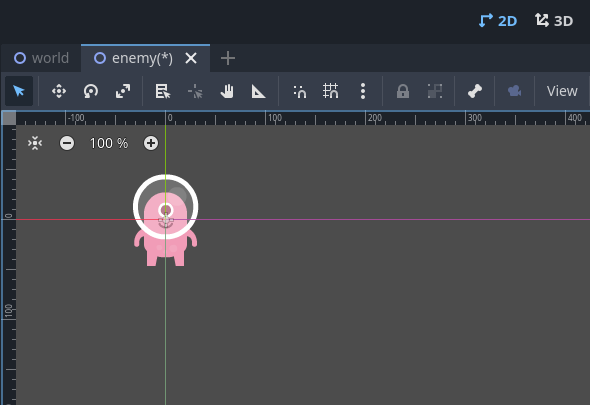

次に、WorldシーンにEnemyシーンを表示させましょう。
まずは、左下のFileSystemウィンドウ内にあるworld.tscn(Worldシーンを保存したファイルですね)をダブルクリックしましょう。左上のSceneウィンドウがWorldシーンの内容になっていれば成功です。今はWorldノードしか存在しませんね。ここに、FileSystemウィンドウのenemy.tscnからScneウィンドウのWorldノードまでドラッグアンドドロップします。

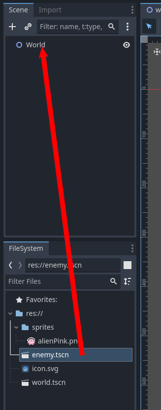

Sceneウィンドウが下図のようになっていて、worldシーンの2Dウィンドウにピンクエイリアンが表示されていれば成功です。

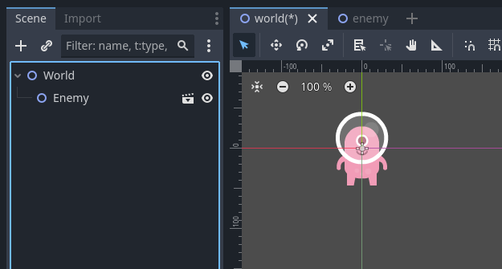

次にworldシーンの2Dウィンドウを少しズームアウトさせます。ズームアウトはworldシーンの2Dウィンドウの左上にある-ボタンを押すか(下図の赤枠のことです)、マウスホイールがついているマウスの人は手前にマウスホイールを回すとズームアウトします。すると以下の図のようになります。

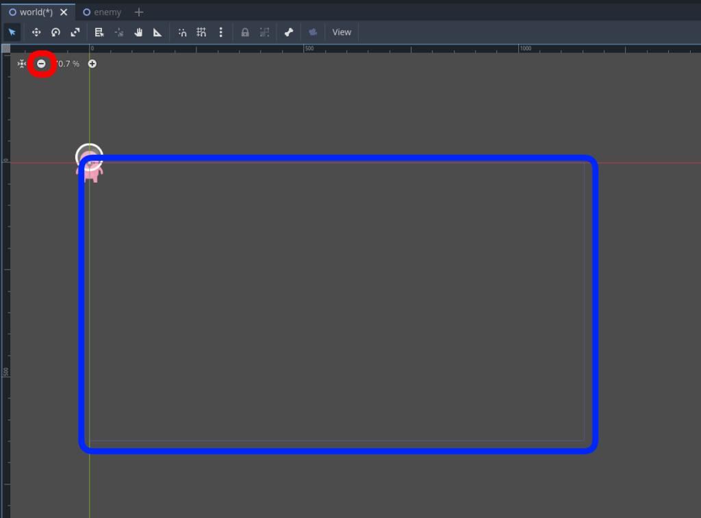

上図の青枠(上は赤線、左は緑線、残りは青線で囲まれた四角形のエリア)は実際にゲームにしたときに表示されるウィンドウのエリアです。今はあまりにも敵であるピンクエイリアンが左上すぎるので画面中央付近にドラッグアンドドロップしましょう。すると下図のようになります。

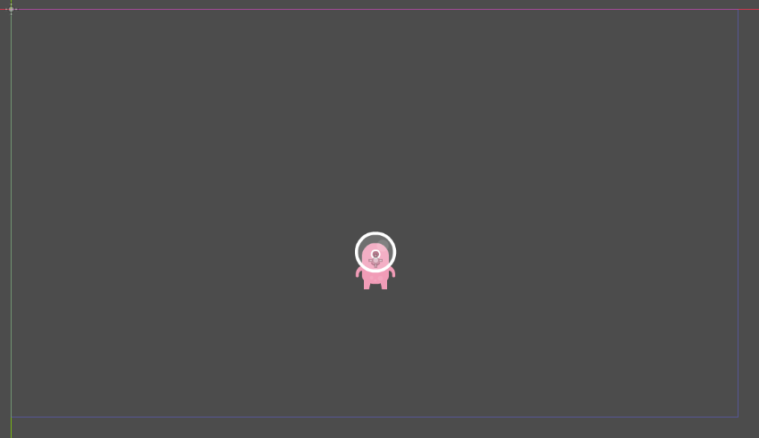

あと、敵というには少し小さい気がするので少し大きくしてあげましょう。
左上のSceneウィンドウでEnemyノードを選択すると右上のInspectorウィンドウのNode2DエリアにTransformという欄があるのでクリックしてみましょう。

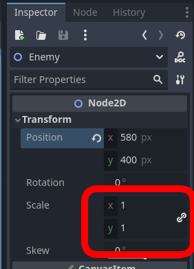

ここのxとyの値を3にしてあげましょう。するとピンクエイリアンが3倍の大きさになるはずです。
ちなみにPositionの値はピンクエイリアンの位置を示しています。先ほどはドラッグアンドドロップで場所を決めたのでこの数字とピッタリ同じである必要はないです。

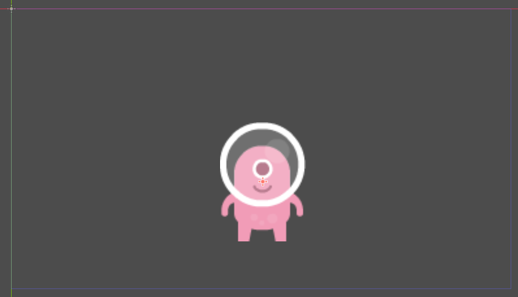

worldシーンの2Dウィンドウが上記のようになっていれば準備完了です。Ctrl+Sを押してworldシーンを保存しておきましょう。

最後に画面にピンクエイリアンが表示されるだけですが、ゲーム画面(正確にはゲームのデバッグ画面を表示して終わりにしましょう)

下図の赤枠で囲った画面右上の右を向いた三角形ボタンを押しましょう。

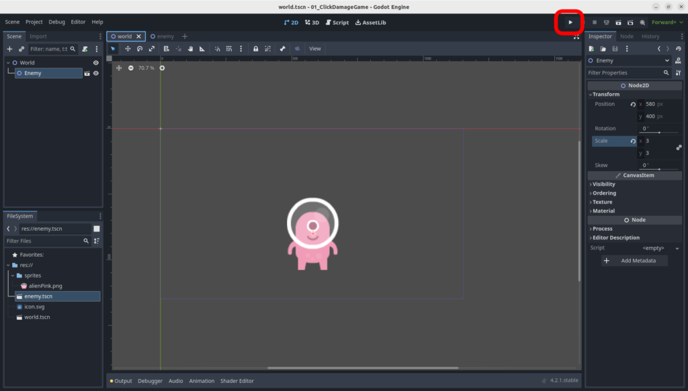

すると以下のダイアログが表示されます。

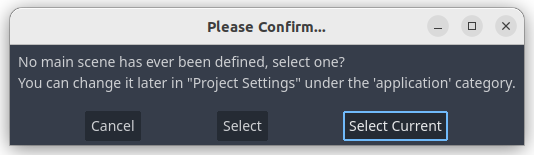

メインシーンが決まっていませんが、現在のシーン(worldシーン)をメインシーンにしてよいですか？ということを聞かれています。今回はworldシーンをメインシーンにしたいのでこのまま”Select Current”を押します。

すると以下のような画面が表示されます。

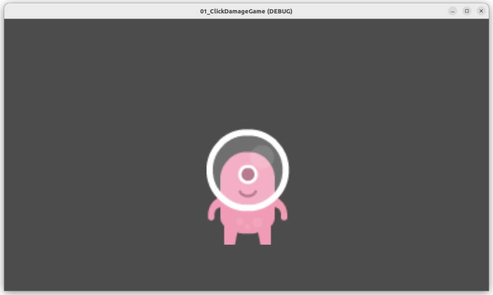

動きはありませんが、ゲーム画面が表示されました。
次回以降はこのゲーム画面に動きをつけていきます。