:::important
この記事はGodot Engine v4.2.1を使って解説しています。
:::

# クリックゲームの作り方

今回は、enemyシーンに設定を加えていきます。
まずは、Enemyノードの配下に子ノードとしてArea2Dノードを追加していきます。
ノード追加の方法は覚えていますか？

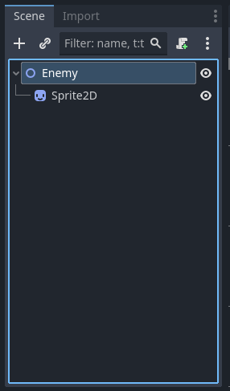

Enemyノードを選択した状態で、右クリックをして”Add Child Node…”を選択するとCreate New Nodeダイアログが開くのでArea2Dを検索します。Area2Dが表示されたら、選択してCreateボタンを押します。

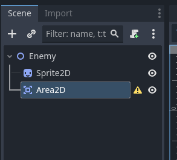

次は<font color="red">Area2D</font>ノードに子ノードとしてCollisionShape2Dノードを追加します。
手順は先ほどとほぼ同様です。Area2Dを右クリックして”Add Child Node…”を選択するとCreate New Nodeダイアログが開くのでCollisionShape2Dを検索します。CollisionShape2Dが表示されたら、選択してCreateボタンを押します。成功すると以下のようになります。

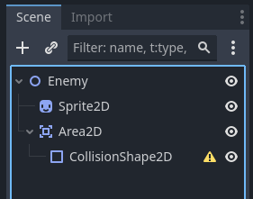

CollisionShape2Dノードは、詳細な設定をすることで当たり判定の処理ができるようになります。
それでは、詳細な設定をしていきましょう。
まずは、SceneウィンドウでCollisionShape2Dノードを選択します。

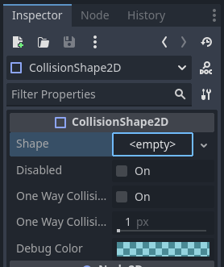

すると、上図のように画面右上のInspectorウィンドウのCollisionShape2DカテゴリーのShapeという項目が<empty>の状態になっています。<empty>の横のvをクリックするとメニューが表示されるので、”New CapsuleShape2D”を選択しましょう。

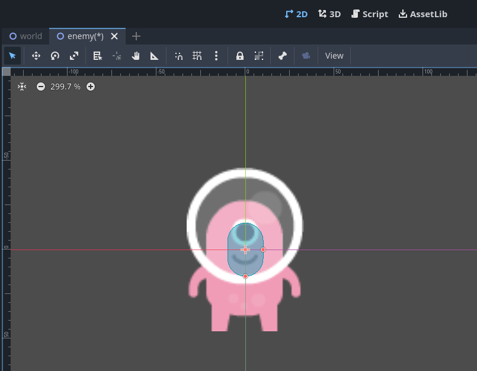

すると、enemyシーンの2Dウィンドウの敵キャラクター上にカプセル型の網掛表示が表示されます。
これが、当たり判定の範囲になるのでカプセルの右と下にある赤点をうまく操作して敵キャラクターとほぼ同じ大きさになるように設定しましょう。

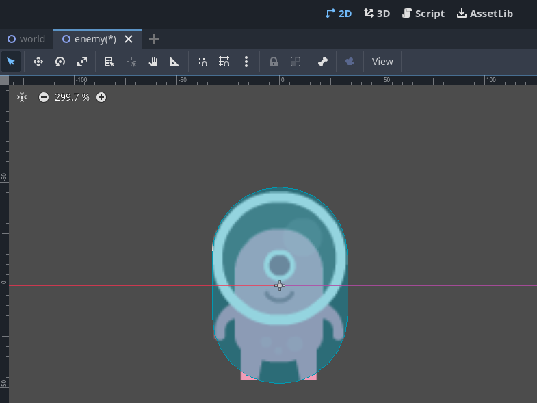

上図のような感じになっていれば成功です。
いったん、ここまでの状態でCtrl + Sで保存しておきましょう。

次に、いよいよゲーム制作っぽいこと”プログラミング”をしていきます。

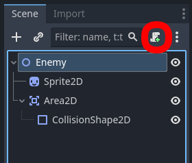

上図のようにEnemyノードを選択した状態で赤枠で囲ったアイコンをクリックしてください

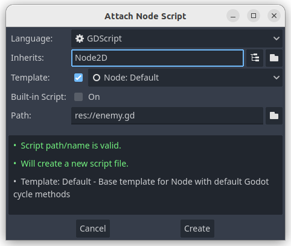

上図のような”Attach Node Script”ダイアログが表示されますが、内容はこのままで良いのでCreateボタンを押しましょう。

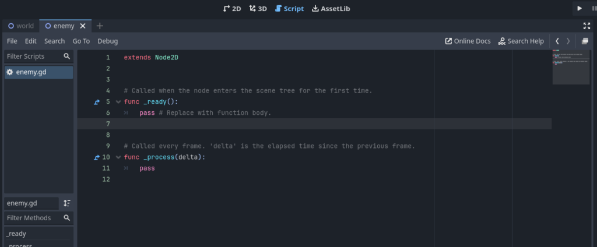

上図のようなenemyシーンのScriptウィンドウが表示されます。
Godotではプログラムはこのような画面に記述していきます。
まずは、SceneウィンドウでArea2Dノードを選択した状態で、画面右側のInspectorタブをNodeタブに切り替えます。

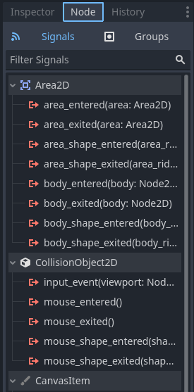

上図のようになっていれば成功です。
このうち、CollisionObject2Dカテゴリの中で「input_event(viewport: Nod…」となっている項目があります。これを右クリックすると、メニューが表示されるのでConnect…を選択します。

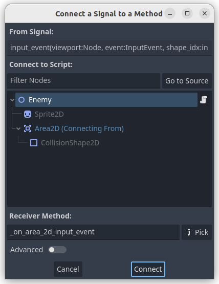

すると、”Connect a Signal to a Method”ダイアログが表示されますが、この内容で問題ないのでConnectボタンを押します。するとenemyシーンのScriptウィンドウが以下のようになっています。

```gdscript
extends Node2D


# Called when the node enters the scene tree for the first time.
func _ready():
	pass # Replace with function body.


# Called every frame. 'delta' is the elapsed time since the previous frame.
func _process(delta):
	pass


func _on_area_2d_input_event(viewport, event, shape_idx):
	pass # Replace with function body.
```

14行目と15行目に新しくスクリプトが追加されました。追加されたのは_on_area_2d_input_event関数です。この関数には、CollisionShape2Dノードで設定した当たり判定に何か入力イベントが起きたときに実行したい内容を記述していきます。
今回実行したい、敵キャラクターを「マウスでクリック」も入力イベントです。
今回の投稿はここまでですが、今後実施していくことは敵キャラクターに被せた見えない当たり判定に「マウスでクリック」イベントが発生した際にダメージを与えていく処理を追加していくこと、になります。