:::important
この記事はGodot Engine v4.2.1を使って解説しています。
:::

# クリックゲームの作り方

前回、作成した_on_area_2d_input_event関数に中身を記述していきます。
まずは、本格的に関数の中身を記述する前にsceneウィンドウのArea2DノードをドラッグしながらCtrlキーを押してスクリプト画面の3行目付近にドロップします。すると以下のようになります。

```gdscript
extends Node2D

@onready var area_2d = $Area2D

# Called when the node enters the scene tree for the first time.
func _ready():
	pass # Replace with function body.


# Called every frame. 'delta' is the elapsed time since the previous frame.
func _process(delta):
	pass


func _on_area_2d_input_event(viewport, event, shape_idx):
	pass # Replace with function body.
```

3行目の内容によって、ドラッグ元のArea2Dノードにarea_2dという変数名でアクセスできるようになりました。次に、_on_area_2d_input_event関数の中身を記述します。関数に以下のように追記してください。

```gdscript
extends Node2D

@onready var sprite_2d = $Sprite2D

# Called when the node enters the scene tree for the first time.
func _ready():
	pass


# Called every frame. 'delta' is the elapsed time since the previous frame.
func _process(delta):
	pass

func _on_area_2d_input_event(viewport, event, shape_idx):
	if event is InputEventMouseButton:
		if event.is_pressed():
			sprite_2d.modulate = Color.RED
			await get_tree().create_timer(0.1).timeout
			sprite_2d.modulate = Color.WHITE
```

追記した内容について説明していきます。
_on_area_2d_input_event関数は以前設定した当たり判定に何か入力があった際(イベント)に反応する関数です。15行目で、発生したイベントがInputEventMouseButton、つまりマウスのボタンに関連するイベントかを判断しています。マウスのボタンに関連するイベントでなければ、何もしません。逆にマウスのボタンに関するイベントの場合は、16行目でさらに情報を探っています。
16行目でevent.is_pressed()、つまりマウスボタンが押されたのかを確認しています。押されたのであれば17行目から19行目の処理を行います。
この処理は17行目で敵キャラクターを赤っぽくして、18行目で0.1秒まって19行目でまた元の色に戻しています。

この状態でF5キーを押すとゲームのデバッグができます。以下のようになっていれば成功です。
最初に映る1という数字は気にしないでください。録画ソフトのカウントダウンが映ってしまいました。
また、マウスのカーソルも写っていませんが、敵キャラクター上で左クリックしています。

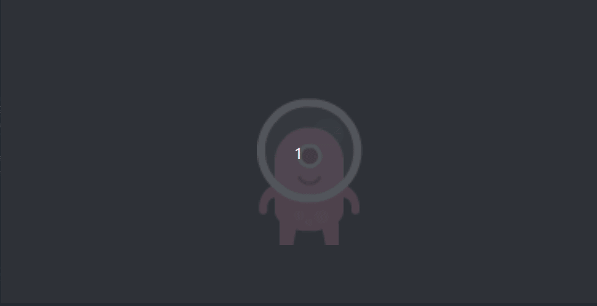

これで敵キャラクターにマウスクリックによってダメージを与えている演出をすることができました。
しかし、少し物足りないので「敵キャラクターのダメージ量の表示」と「敵キャラクターを倒したら自動的にゲーム終了」の2つの処理を追加しましょう。

まずは敵キャラクターのダメージ量の表示です。
Scene画面のEnemyノード配下にProgressBarノードを追加します。
これまでに何回か実施してきたので作業手順は省略します。
いかのようになっていれば成功です。

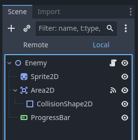

現在、スクリプトが映っているウィンドウの上の以下の図の赤枠で囲った2Dボタンを押します。

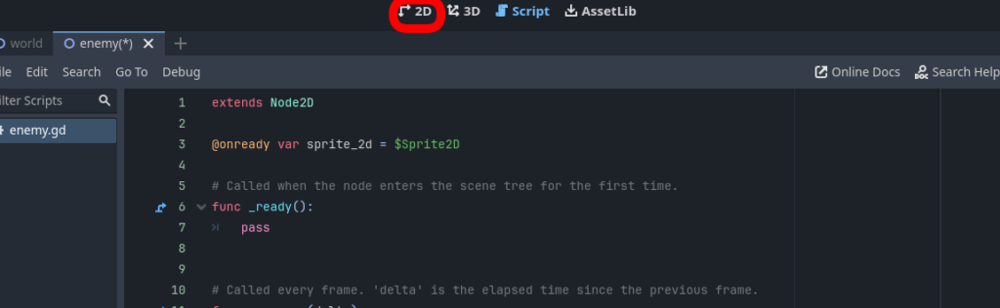

SceneウィンドウでProgressBarノードを選択すると下図のようになると思います。

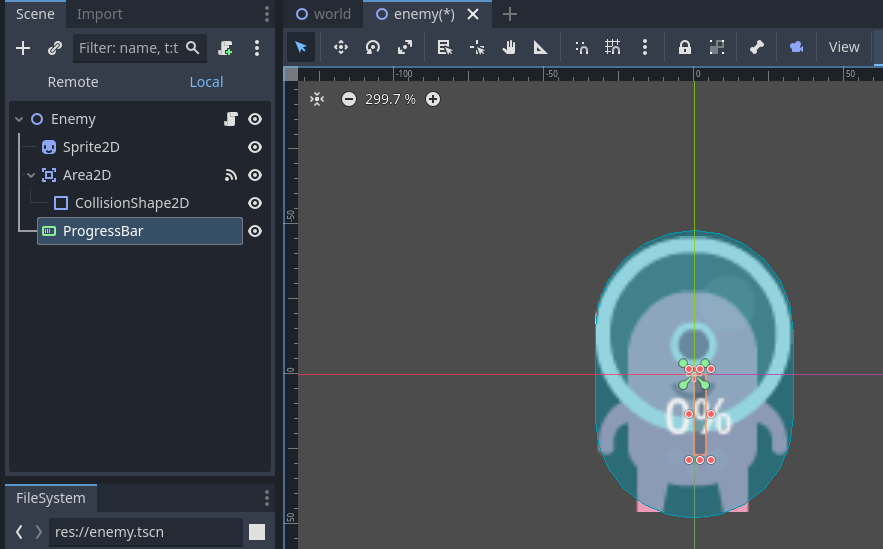

敵キャラクターの上に0%と書かれた楕円があると思います。
これを敵キャラクターの少し上にドラッグアンドドロップで持っていきます。

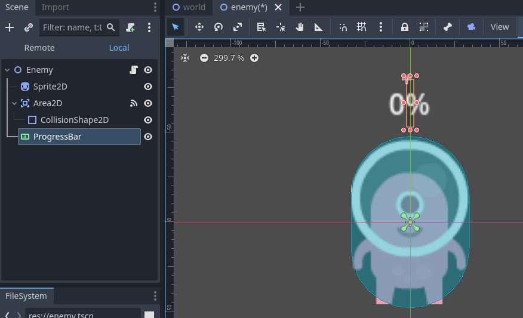

次にこの状態で画面右側のInspectorタブを確認します。

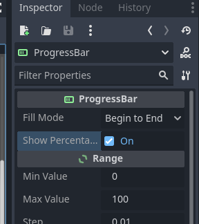

ProgressBarカテゴリー内の”Show Percenta…”がOnになっているのでOffにします。

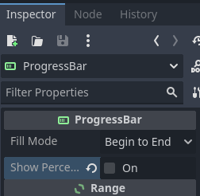

上記のようになっていれば成功です。
次に同じInspector画面のControl->Theme Overrides->Stylesと辿っていくと赤枠で囲った”Backgro…”と”Fill”があると思います。ここにそれぞれ黒色と赤色を設定していきます。

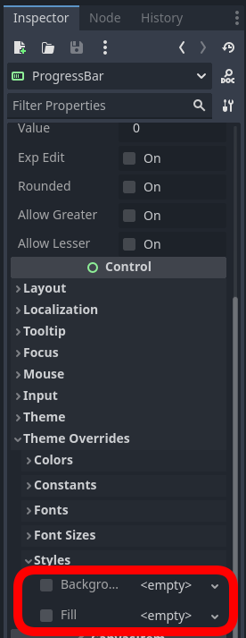

具体的な方法としては、両項目ともにvボタンを押すとメニューが出てくるので”New StyleBoxFlat”を選択すると以下のような画面になります。ここでBG Colorの右側の灰色の枠をクリックすると色を選択できます。

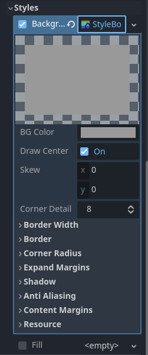

以下のように黒色を選択できれば成功です。同様にFillについても赤色を選択します。

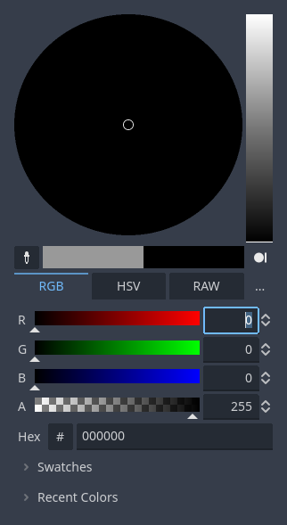

最後に2D画面でProgressBarを敵キャラクターの上で横長の細長い形に変形させます。
以下のようになっていれば完成です。

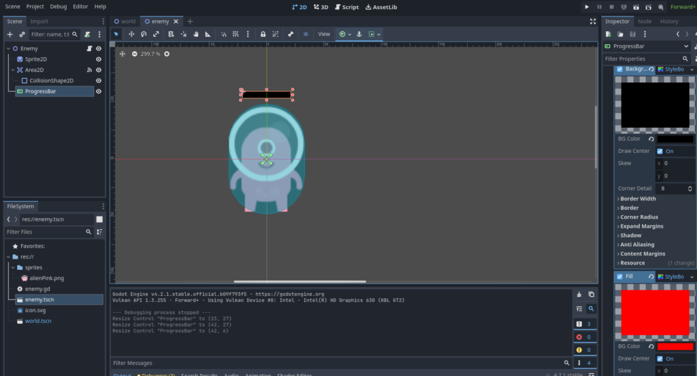

最後にScript画面に戻って最後のプログラムをします。

```gdscript
extends Node2D

@onready var sprite_2d = $Sprite2D
@onready var progress_bar = $ProgressBar

# Called when the node enters the scene tree for the first time.
func _ready():
	progress_bar.value = 100


# Called every frame. 'delta' is the elapsed time since the previous frame.
func _process(delta):
	pass

func _on_area_2d_input_event(viewport, event, shape_idx):
	if event is InputEventMouseButton:
		if event.is_pressed():
			progress_bar.value -= 10
			sprite_2d.modulate = Color.RED
			await get_tree().create_timer(0.1).timeout
			sprite_2d.modulate = Color.WHITE
		if progress_bar.value <= 0:
			queue_free()
			get_parent().get_tree().quit()
```

上記のようなプログラムに変更してください。追記した部分を説明します。
まず、4行目にsprite_2dのときと同様にProgressBarノードをドラッグ＋Ctrlキーをしてドロップすることで配置します。これでProgressBarにスクリプト上からアクセスできるようになりました。

次に8行目にprogress_bar.value = 100を追加しています。これによってBrogressBarのゲージの値が100になりました。初期設定でProgressBarの最大値は100になっているのでゲージを最大の状態(敵キャラクターのHPが全回復している状態)を表しています。

次に18行目にprogress_bar.value -= 10としています。ここはマウスをクリックした際の処理を記述する箇所でした。つまり、クリックするごとにHPを10減らす処理をしています。(10回クリックすれば倒せますね。)

最後に「敵キャラクターを倒したら自動的にゲーム終了」のスクリプトが22行目から24行目の処理になります。内容としては、ProgressBarの値が0以下になったら(つまり敵キャラクターのHPが0になったら)敵キャラクターの表示を消して、ゲームを終了する処理です。

これでゲームの完成です。
F5キーを押して期待通りのゲームになっているか試してみてください。

プレイしてみると、とても簡単なゲームですが作るのは以外と難しかったと思います。
次回以降はさらに難しいゲームに挑戦していきます。